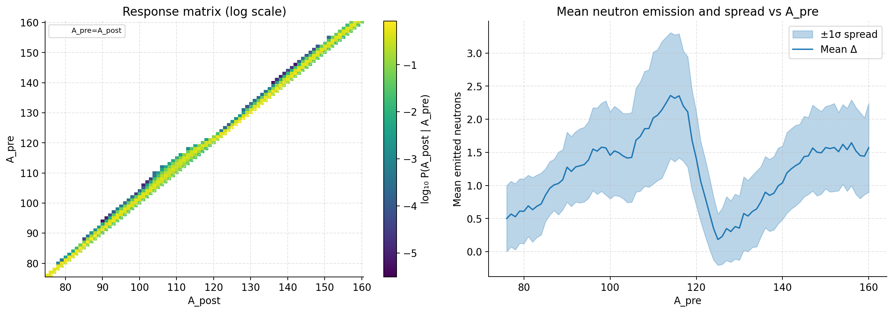
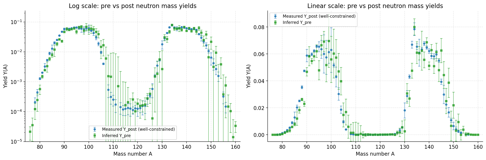
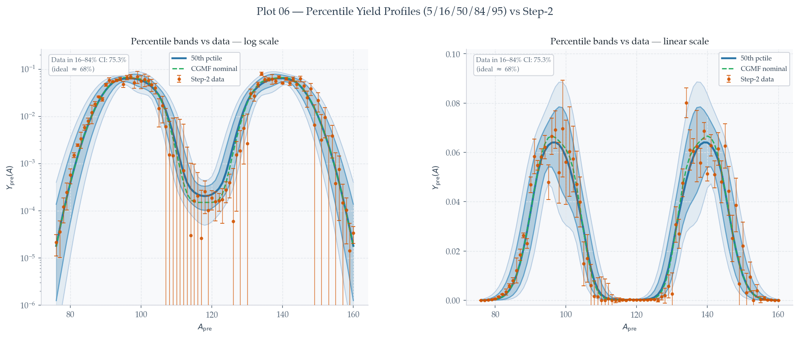

# YAModel Sampling

## Overview

Written as a sub-project within cgmf_uq

In CGMF mass yields are parametised in the associated input .dat file as pre emission $Y(A)$ in triple Gaussian form. The fit consists of 3 Gaussians (two of which are flipped across the symmetric point, totaling 5 Gaussians). The base Gaussian function is:

$$G(A,E) = \frac{w(E)}{\sqrt{2\pi\sigma(E)^2}} \exp\left[-\frac{(A-\mu(E))^2}{2\sigma(E)^2}\right]$$

The parameters for weight ($w$), mean ($\mu$), and standard deviation ($\sigma$) depend on the incident neutron energy ($E$):

$$w(E) = \frac{1}{1+\exp\left[\frac{E-w_a}{w_b}\right]}$$
$$\mu(E) = \mu_a + \mu_b E$$
$$\sigma(E) = \sigma_a + \sigma_b E$$

### Parameter Structure

The data file lists 14 specific values required for the 3-G fit, immediately following the ZAI of the compound nucleus ($-Z$ for spontaneous fission):

- `w_a1`, `w_b1`, `mu_a1`, `mu_b1`, `sigma_a1`, `sigma_b1` First primary peak parameters
- `w_a2`, `w_b2`, `mu_a2`, `mu_b2`, `sigma_a2`, `sigma_b2` Second primary peak parameters
- `sigma_a3`, `sigma_b3` Symmetric peak parameters

The weight and mean of the symmetric peak (peak 3) are fixed by the following relationships, where $w_1$ and $w_2$ are the primary peak weights and $A_0$ is the compound nucleus mass:

$$2 = 2w_1(E) + 2w_2(E) + w_3(E)$$
$$\mu_3(E) = \frac{A_0}{2}$$

**Note**: This 3-Gaussian parameterisation is limited in that shell effects and odd-even staggering are ignored. However as this is the parameterisation used in CGMF, it is necessary to sample within this model.

## The Problem \& The Solution

CGMF is extremely sensitive to many of these yield defining parameters. There is strong Yield-TKE coupling where if yields are sampled irresponsibly TKE can exceed the Q-value defined by respective fragment masses. Additionally, constraints placed on the weight paramters mean these paramters cannot be sampled in isolation of one another

These issues motivated a physics driven approach of sampling these correalted parameters, the broad workflow is as follows:

- 1) Extract evaluated mass yield files in the format $Y(A,Z)$ - post emission
- 2) Collapse these evaluated values into $Y(A)$ - post emission
- 3) Generate a response matrix (M) using CGMF which maps $Y_{pre}(A)$ to $Y_{post}(A)$
- 4) Use Tikhonov Regularisation to perform the inversion $Y_{pre}(A)$ = $M^{-1}$$Y_{post}(A)$
- 5) Use Markov Chain Monte Carlo to sample parameters and Bayesian inference to update understanding of parameter distributions

**Output**

Assume all paramters follow Gaussian distributions. Final result is:
- Mean Values ($\mu$) for each of the 14 paramters
- Covariance matrix describing parameter uncertainties and correlations between parameters (stored as Cholesky decomposed lower matrix ($L$)).

These can then be sampled on line to produce plausible, random 3-Gaussian parameterisation of pre-emission fragment mass yields. This sampling is done according to:

$$ \theta = \mu + LZ $$

where $Z$ represents an appropriately sized collumn vector of numbers sampled from a standard normal ( mean = 0, variance = 1 ).

**Note**

Tikhonov Regularisation for solving inverse problems, Markov Chain Monte Carlo and Bayesian Inference all have breif intros in their own README files, including specifics on the implementation in this project (Coming Soon).

## Results

Left: Input response matrix describing pre to post mass yields calculated from 100 000 events of U-235 thermal fission. Right: Associated mass-dependent mean neutron emission.

Output plots showing pre emission yields calculated from the response matrix and ENDF/B-VIII.0 post emission yields with evaluated yields overlaid

Plots showing final posterior mass yields calculated after MCMC treatment.

Correlation matrix describing underlying 3-Gaussian paramters after MCMC calculations.

Output of 2000 random samples of the mean and covariance information output from the MCMC calculations

**Note** All scripts output data which is used by subsequent scripts in a chain. These data are in .npz format, .npz files have been removed from examples due to their large size.

## How To Run
Example workflow is as follows:

Place evaluated yields file in working directory as CSV, verify that the $Y(A,Z)$ to $Y(A)$ collapse is performed correctly using

'python STEP_01_Load_Data.py --input Example_In_Outputs/U235_Thermal.csv'

This generates the file step1_output.npz for future use.

Elsewhere generate CGMF histories file for desired fissioning system. Generate the response matrix JSON output using

`Generate_CGMF_Response_Matrix.py path/to/histories --output out_response_matrix.json'

**Note** This project was designed to be run using HPC. You can input as many input histories files as you want as long as they are listed first after the python script.

Solve the inverse problem using Tikhonov Regularisation

`python STEP_02_Post_to_Pre.py --post_npz step1_output.npz --response_json out_response_matrix.json   --outdir Example_In_Outputs/step2_out   --nonnegative`

Build the MCMC model and use it to find optimal parameter distributions, run it with, for example

` python STEP_03_MCMC.py --npz Example_In_Outputs/step2_out/step2_pre_yields.npz  --A0 236 --En 2.53e-8  --outdir Example_In_Outputs/step_3_mcmc_put   --nwalkers 100 --nsteps 60000 --burnin 10000 --thin 15`

**Note** This stage is where all the hard work occurs. Choosing appropriate Priors is essential to generate plausible parameter distributions

Sample from the $\mu$ and $L$ output from step 3 to see the practical effects of the posteriors calculated during MCMC

`python STEP_04_Sampling_Diagnostics.py --npz Example_In_Outputs/step_3_mcmc_out/step3_mcmc.npz --A0 236 --En 2.53e-8 --N 20000 --outdir Example_In_Outputs/step_04_Sampling`

**Note** All python scripts in this project have more than the listed parameters, investigate yourself using --help!
